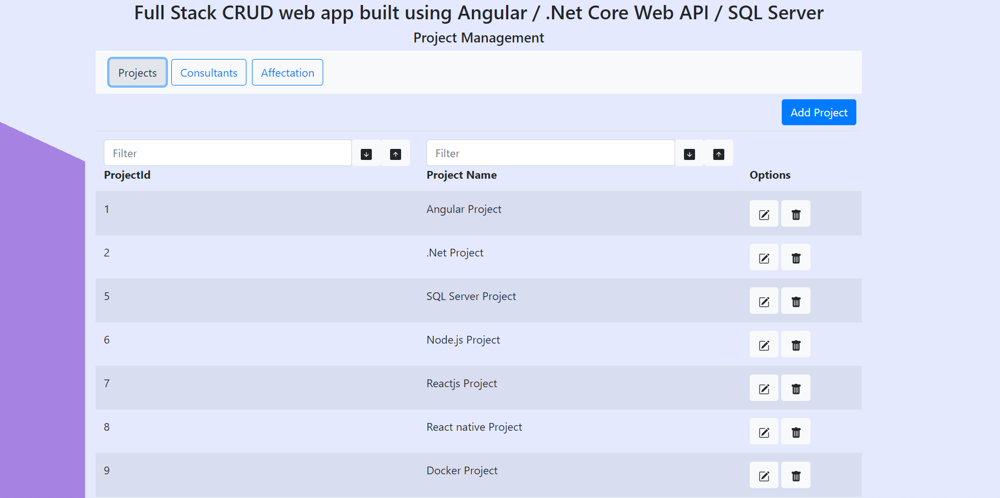
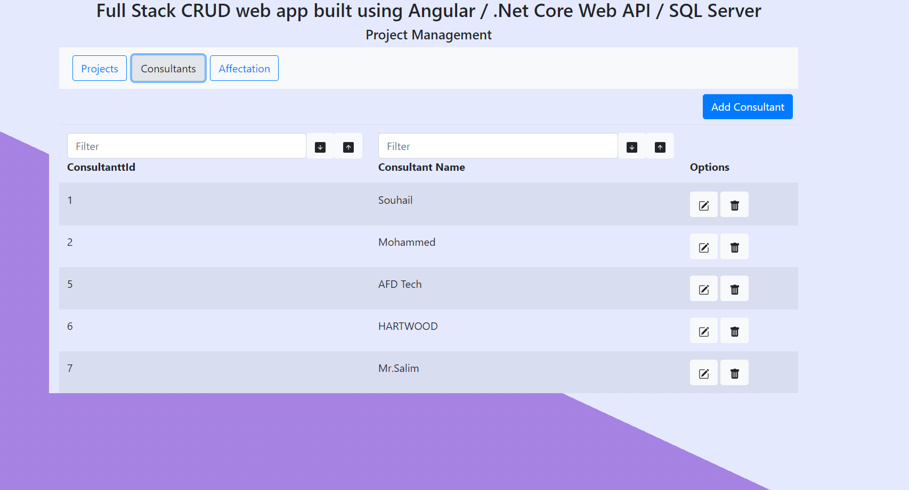
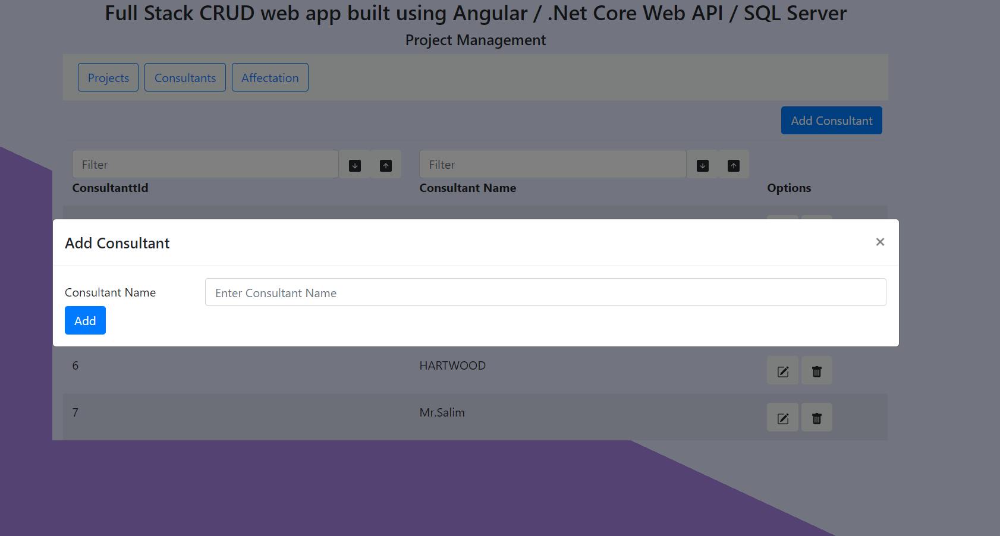

# ProjectAffectationAFD
A Full Stack basic CRUD application for project assignment built using .net core web api for the back end sql server for the data base and angular framework for the front end.


## This project consists of two parts the beck-end and front-end each on a seprate folder !
- The Back-end consists of an SQL Server Data Base connected to a .Net core Web API / ( without the use of the Entity framework ) 
- The front-end consists of an Angular app that fetchs the json data and displays it in a dynamic table ( with basic CRUD Operations and search and filtering ) 


### Installation
For the front-end application : 
Start by cloning the back-end repository.
Install the dependencies and start the server.

```sh
$ cd AngularProject
$ npm install 
$ ng serve --open 
```

For the back-end application : 
Start by cloning the repository.
Import the .net project.

For the data base part : 
Start by importing the data base in microsot sql management studio
### Overview 

The back-end part of the app is made using .net core web api ( v5.01 ) in order to implement an API that allows the following operations:
- list the projects
- list the consultants 
- Add a project or a consultant
- Update a project or a consultant
- Delete a project or a consultant 
- Filter by ( id, name ...) field the list of projects or consultants
- Search by ( id,name ...) field the list of the projects or consultants

the output format is in JSON.

## Screenshot

The final result of the project looks like :






